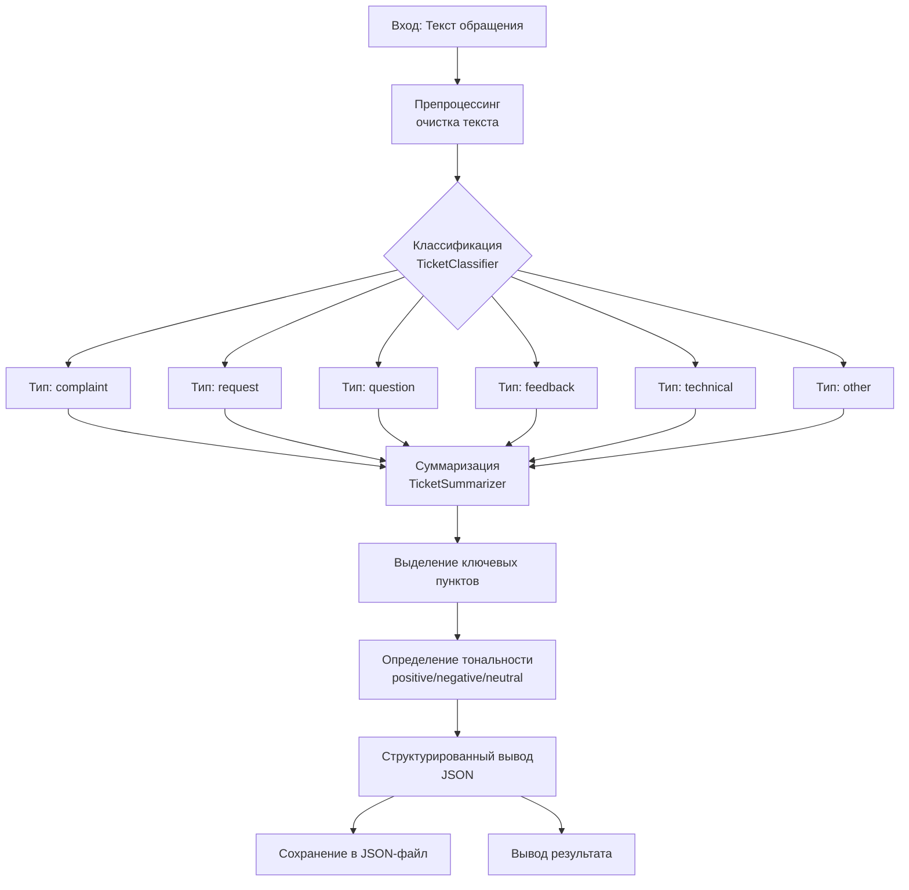

# AI-агент для обработки обращений — Flow

## Общая архитектура



## Детальный Flow

| Этап | Компонент | Описание | Вход | Выход |
|------|-----------|----------|------|-------|
| 1 | **Вход** | Пользователь вводит текст обращения | Текст обращения | Текст обращения |
| 2 | **Классификация** | `TicketClassifier` | Определяет тип запроса | Текст обращения | Тип запроса, уверенность, причина |
| 3 | **Суммаризация** | `TicketSummarizer` | Создаёт краткое изложение | Текст обращения | Краткое изложение (1-2 предложения) |
| 4 | **Ключевые пункты** | `TicketSummarizer` | Выделяет 3-5 ключевых пунктов | Текст обращения | Список ключевых пунктов |
| 5 | **Тональность** | `TicketSummarizer` | Определяет эмоциональную окраску | Текст обращения | positive / negative / neutral |
| 6 | **Структурирование** | `TicketProcessor` | Формирует JSON-ответ | Все данные | JSON-объект |
| 7 | **Сохранение** | `TicketProcessor` | Сохраняет в `data/tickets.json` | JSON-объект | JSON-файл |
| 8 | **Вывод** | `main.py` | Отображает результат | JSON-объект | Вывод в консоль |

## Схема данных

```json
{
  "original_text": "У меня не работает приложение...",
  "classification": {
    "type": "complaint",
    "confidence": 0.85,
    "reason": "Обнаружены жалобы в тексте"
  },
  "summary": {
    "summary": "Пользователь сообщает о проблеме с приложением",
    "key_points": [
      "Приложение вылетает при открытии заказов",
      "Проблема повторяется трижды за день"
    ],
    "sentiment": "negative"
  },
  "structured": {
    "user_id": "user_1",
    "source": "demo",
    "type": "complaint",
    "summary": "Пользователь сообщает о проблеме с приложением",
    "sentiment": "negative"
  },
  "processed_at": "2026-07-15T12:30:00"
}
```

## Компоненты системы

| Компонент | Файл | Ответственность |
|-----------|------|-----------------|
| **TicketProcessor** | `agent.py` | Оркестратор всего процесса |
| **TicketClassifier** | `classifier.py` | Классификация запросов |
| **TicketSummarizer** | `summarizer.py` | Суммаризация и анализ тональности |
| **Модели данных** | `models.py` | Pydantic-схемы |
| **Точка входа** | `main.py` | CLI-интерфейс |
| **Хранилище** | `data/tickets.json` | Сохранение истории |